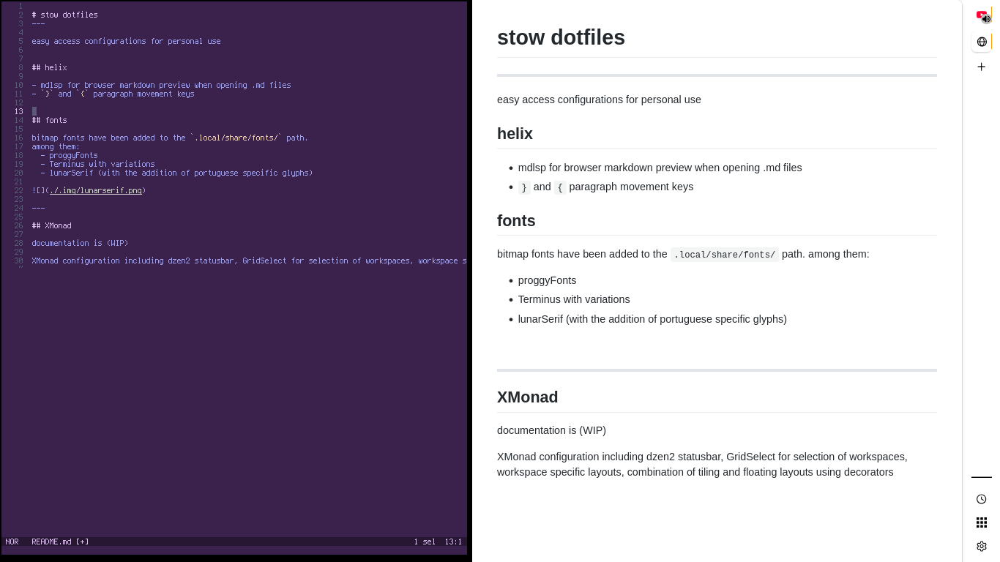
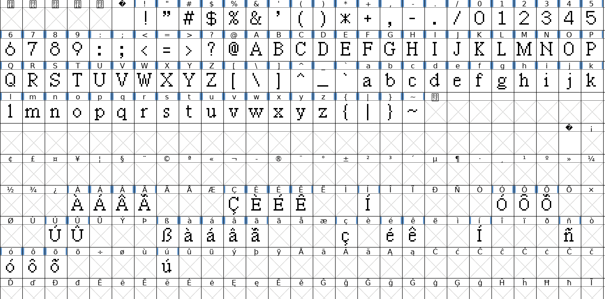

# stow dotfiles
---

easy access configurations for personal use

## helix

- mdlsp for browser markdown preview when opening .md files  
- `}` and `{` paragraph movement keys

## fonts

bitmap fonts have been added to the `.local/share/fonts/` path.
among them:
  - proggyFonts
  - Terminus with variations
  - lunarSerif (with the addition of portuguese specific glyphs)

---

## XMonad

documentation is (WIP)

XMonad configuration including dzen2 statusbar, custom decorators, GridSelect for workspace selection, workspace specific layouts, combination of tiling and floating layouts
